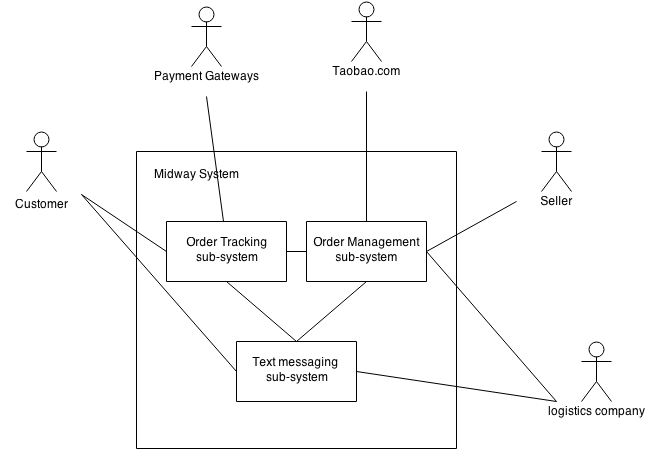

# System Environment

The Midway System has three active actors and three cooperating sub-systems. 
The Seller, Customer, or Logistics Company's employee accesses the Midway System through the internet. Customers can interact with Midway System either through text-messaging sub-system or the online Order Tracking Sub-system. Sellers can perform all operations needed in the Order Management Sub-system, while logistics company's employee may perform some operations via the text messaging sub-system.